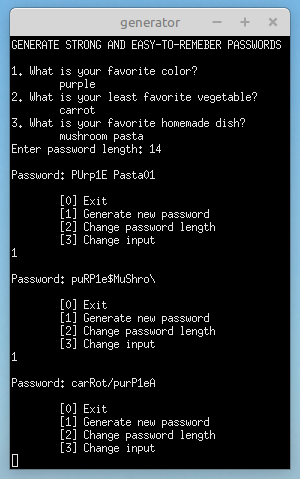

# Memorable password generator
A C++ code to generate __strong__ and __easy-to-remember__ passwords based on the user's input. Passwords contain digits, lowercase, uppercase and special characters. The length is customizable.   
_100% C++, no AI tools used._
## Input and output
Users are asked {3} random [questions](security_questions.txt) related to their interests, likes, wishes, etc. <ins>The answers</ins> are used to generate passwords that have __personal meaning__ and thus are __easier to memorize__. The input is transformed by adding digits, uppercase, lowercase and special characters (if needed) to make passwords more __secure__. These additional characters are either added to the existing ones or replace them in a way that does not affect the __readability__.  
<ins>The password length</ins> is customizable. The default length is {16} characters, and the minimum is {1} character.  
Based on the input, users can generate as many passwords as they want to select the most memorable. They can also change the password length and/or answer another set of questions.
## Example

### References
* _How long should a password be?_ | _Bitwarden._ (2025, January 30). Bitwarden. https://bitwarden.com/blog/how-long-should-my-password-be/
* _Password Special Characters_ | _OWASP Foundation._ (n.d.). https://owasp.org/www-community/password-special-characters
* Romelyn. (2024, December 13). _Top 40 best security questions: All you need to know - BitGlint._ BitGlint. https://www.bitglint.com/best-security-questions-all-you-need-to-know/
